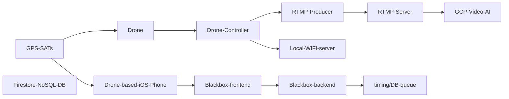

# drone-streaming-extraction
- Blog:  https://github.com/ObrienlabsDev/blog/wiki/Drone-Streaming-Extraction
- see https://github.com/CloudLandingZone/poc-gcp-serverless-drone-stream-ai
- Drone API for Entity Extraction
- https://cloud.google.com/video-intelligence


## Use Cases

### Use Cases Diagram


[mermaid - diagrams as code](https://mermaid-js.github.io/mermaid/#/flowchart?id=graph)

### UC 1: Runway Surface Inspection using AM/ML on realtime RTMP Drone Streaming Video

### UC 2: Runway Surface Inspection using AM/ML on Drone based IPhone Lidar Scanning


### UC 3: Entity Extraction using AM/ML on realtime RTMP Drone Streaming Video

### UC 10: Drone Tracking via DroneID and SDR
#### GPS Drone Tracking: SDR - DroneID Capture
- DroneID https://github.com/RUB-SysSec/DroneSecurity/issues/2

step 1: new to SDR - setting up my B205mini using a VMware Ubuntu VM on one of older Mac's (intel chip)
Following Whitney's tutorials

- https://www.hackster.io/whitney-knitter/getting-started-with-the-ettus-b205mini-in-gnu-radio-e0d3ea
- https://www.hackster.io/whitney-knitter/basic-rf-test-verification-on-the-b205mini-with-gnu-radio-1cd612


### UC 11: Drone Tracking via attached Iphone/Android and GPS blackbox app
#### GPS Drone Tracking: attached iPhone 13 mini or Samsung S23


### UC 20: Generative-AI: Prompt for spatial or SQL queries

### UC 21: Generative-AI: Prompt for summary of High/Low entity/problem reports


## Requirements

## Introduction
A POC around a GCP AI serverless infrastructure and drone stream client


# Architecture

- rtmp source (drone)
- rtmp backend (gcp container)
- rtmp processor/pipeline (client 1 of n)

# Design
## Criteria
- Speed
- Flexibility
- Serverless

## AI Integration
Vertex AI is for custom AI development.  AutoML is for out of the box pretrained models.

## Injestion
## Preparation
Vertex AI data prep
## Entity Extraction


# Design Issues
## DI 1: GCP Infrastructure Design
## DI 2: Realtime or Offline Processing
## DI 3: RTMP: Streaming Video Processing
## DI 10: Backend Database Options
- Firestore (NoSQL) - native mode - https://cloud.google.com/datastore/docs/firestore-or-datastore

- Experimentation around the RTMP protocol
### Test Locally on docker inside on-prem network

#### Docker environment in VM or Bare Metal
- Refer to https://www.nginx.com/blog/video-streaming-for-remote-learning-with-nginx/
- use prepagaged container from tiangelo at https://hub.docker.com/r/tiangolo/nginx-rtmp/

#### rtmp backend (F5 Nginx)
- check https://hub.docker.com/r/tiangolo/nginx-rtmp/
- On i7-8700 Mac Mini (bare metal Ubuntu 22.04)

##### RTMP on Bare Metal
```
sudo apt install docker.io
sudo usermod -aG docker ubuntu
sudo reboot now
ubuntu@mini5:~$ docker run -d -p 1935:1935 --name nginx-rtmp tiangolo/nginx-rtmp
ubuntu@mini5:~$ docker ps
CONTAINER ID   IMAGE                 COMMAND                  CREATED         STATUS         PORTS                                       NAMES
cd5ebbac51a3   tiangolo/nginx-rtmp   "nginx -g 'daemon of…"   5 seconds ago   Up 2 seconds   0.0.0.0:1935->1935/tcp, :::1935->1935/tcp   nginx-rtmp


logs locally
192.168.0.24 [01/Apr/2023:14:24:12 +0000] PLAY "live" "drone" "" - 417 13153219 "" "LNX 9,0,124,2" (19s)
192.168.0.19 [01/Apr/2023:14:24:52 +0000] PUBLISH "live" "drone" "" - 372055726 529 "" "" (11m 47s)

logs remote drone up the hill via cell hotspot
2023/04/01 21:15:46 [error] 9#9: *234 live: already publishing, client: , server: 0.0.0.0:1935

switched hotspot from iphone to ipad
24.114.94.29 [01/Apr/2023:21:17:38 +0000] PLAY "live" "drone" "" - 376 454 "" "LNX 9,0,124,2" (37s)
24.114.94.29 [01/Apr/2023:21:18:44 +0000] PLAY "live" "drone" "" - 376 454 "" "LNX 9,0,124,2" (1m 4s)
24.114.98.182 [01/Apr/2023:21:18:56 +0000] PUBLISH "live" "drone" "" - 30184047 412 "" "" (3m 10s)
2023/04/01 21:19:07 [error] 8#8: *256 live: already publishing, client: 24.114.98.182, server: 0.0.0.0:1935

24.114.85.203 [01/Apr/2023:21:30:52 +0000] PUBLISH "live" "drone" "" - 148641484 607 "" "" (25m 22s)
24.114.98.182 [01/Apr/2023:21:33:32 +0000] PUBLISH "live" "drone" "" - 52357335 430 "" "" (5m 0s)
2023/04/01 21:33:33 [error] 8#8: *326 live: already publishing, client: 24.114.98.182, server: 0.0.0.0:1935

24.114.98.182 [01/Apr/2023:21:35:00 +0000] PUBLISH "live" "drone" "" - 39086027 427 "" "" (3m 21s)
24.114.98.182 [01/Apr/2023:21:37:50 +0000] PUBLISH "live" "drone" "" - 6669702 448 "" "" (4m 17s)
24.114.98.182 [01/Apr/2023:21:39:30 +0000] PUBLISH "live" "drone" "" - 167359073 538 "" "" (20m 23s)

24.114.94.29 [01/Apr/2023:21:39:53 +0000] PLAY "live" "drone" "" - 492 18003597 "" "LNX 9,0,124,2" (11m 28s)

```

#### Google Cloud Run

- move the dockerhub image to artifact registry
```
docker pull tiangolo/nginx-rtmp
gcloud artifacts repositories create $AR_PIPELINE_NAME --location=$REGION --repository-format=docker
check repo
gcloud artifacts repositories describe rtmp-pipeline-csr --project=drone-ol --location=$REGION

northamerica-northeast1-docker.pkg.dev/drone-ol/rtmp-pipeline-csr

add permissions as per helper
gcloud auth configure-docker northamerica-northeast1-docker.pkg.dev
    
add artifiact registry administrator
docker tag tiangolo/nginx-rtmp:latest ${REGION}-docker.pkg.dev/drone-ol/$AR_PIPELINE_NAME/rtmp-pipeline-csr:latest
docker push ${REGION}-docker.pkg.dev/drone-ol/$AR_PIPELINE_NAME/$AR_PIPELINE_NAME:latest

```


https://nginx-rtmp-kkxj4lcnsa-uc-old.a.run.app

```
gcloud run deploy nginx-rtmp \
--image=gcr.io/drone-ol/rtmp-pipeline-csr@sha256:e349d276df7319b668c3155cd4ef5255cd1fc0c520dc119bd7dea004580a22fc \
--allow-unauthenticated \
--port=1935 \
--service-account=452219143276-compute@developer.gserviceaccount.com \
--cpu=2 \
--memory=1Gi \
--min-instances=1 \
--max-instances=4 \
--no-cpu-throttling \
--execution-environment=gen2 \
--region=us-central1 \
--project=drone-ol

```

#### Google Cloud Compute Engine

add firewall rules
```
gcloud compute --project=drone-ol firewall-rules create rtmp --description=rtmp --direction=INGRESS --priority=1000 --network=default --action=ALLOW --rules=tcp:1935 --source-ranges=0.0.0.0/0
gcloud compute --project=drone-ol firewall-rules create rtmp-out --description="rtmp out" --direction=EGRESS --priority=1000 --network=default --action=ALLOW --rules=tcp:1935 --destination-ranges=0.0.0.0/0
```

```
gcloud compute instances create-with-container rtmp --project=drone-ol --zone=northamerica-northeast1-a --machine-type=e2-medium --network-interface=network-tier=PREMIUM,subnet=default --maintenance-policy=MIGRATE --provisioning-model=STANDARD --service-account=452219143276-compute@developer.gserviceaccount.com --scopes=https://www.googleapis.com/auth/devstorage.read_only,https://www.googleapis.com/auth/logging.write,https://www.googleapis.com/auth/monitoring.write,https://www.googleapis.com/auth/servicecontrol,https://www.googleapis.com/auth/service.management.readonly,https://www.googleapis.com/auth/trace.append --tags=http-server,https-server --image=projects/cos-cloud/global/images/cos-stable-101-17162-127-51 --boot-disk-size=10GB --boot-disk-type=pd-balanced --boot-disk-device-name=rtmp --container-image=gcr.io/drone-ol/rtmp-pipeline-csr@sha256:e349d276df7319b668c3155cd4ef5255cd1fc0c520dc119bd7dea004580a22fc --container-restart-policy=always --container-privileged --no-shielded-secure-boot --shielded-vtpm --shielded-integrity-monitoring --labels=ec-src=vm_add-gcloud,container-vm=cos-stable-101-17162-127-51
```

#### Test with OBS
https://hub.docker.com/r/tiangolo/nginx-rtmp/


#### Test view with VLC

- install http://get.videolan.org/vlc/3.0.18/macosx/vlc-3.0.18-arm64.dmg
- configure


- run


### rtmp processor (gcp pipeline)
- https://codelabs.developers.google.com/mediacdn-ls-codelab#0
- https://cloud.google.com/livestream/docs/overview

- rtmp server to processor  https://cloud.google.com/video-intelligence/docs/streaming/live-streaming
- https://cloud.google.com/video-intelligence/docs/streaming/docker-kubernetes
- https://github.com/google/aistreamer/tree/master

in GCP Shell
```
export DOCKER_IMAGE=gcr.io/drone-ol/drone-ol:0.0.1
git clone https://github.com/google/aistreamer.git
cd aistreamer/ingestion/
docker build -t $DOCKER_IMAGE -f env/Dockerfile .
  
4 min
------
 > [ 4/28] RUN easy_install pip:
#0 0.492 Searching for pip
#0 0.492 Reading https://pypi.python.org/simple/pip/
#0 0.630 Scanning index of all packages (this may take a while)
#0 0.630 Reading https://pypi.python.org/simple/
#0 0.630 Couldn't find index page for 'pip' (maybe misspelled?)
#0 0.690 No local packages or download links found for pip
#0 0.691 error: Could not find suitable distribution for Requirement.parse('pip')
------
Dockerfile:80
--------------------
  78 |         && apt-get clean
  79 |
  80 | >>> RUN easy_install pip
  81 |
  82 |     RUN add-apt-repository ppa:jonathonf/ffmpeg-4 -y
--------------------
ERROR: failed to solve: process "/bin/sh -c easy_install pip" did not complete successfully: exit code: 1
```


## DI 4: LIDAR Processing
## DI 5: Network upload bandwidth issues for 5G and LTE
## DI 6: Use Drone with built in SDK/Cloud capability
Choosing a drone with built in CSP/SDK support will change the implementation.  For example the Mavic 3 Classic has the same physical characteristics as the Mavic 3 Enterprise - but without centimeter GPS, the FLIR camera or the built in Cloud SDK.
If using a lower model then an attached smartphone can replace some of this functionality.
## DI 7: Use Drone with centimeter GPS
## DI 8: Use Drone with built in FLIR camera
## DI 9: Use Drone with attached FLIR camera
There is an iphone FLIR camera available.


# Implementation

# Deliverables

# BOM : Bill of Materials

## Smartphone Hardware
## Drone Hardware
### Transport Canada Drone Pilot License
### Transport Canada Drone Registration
## Cloud Provider
## Development Environments


# FinOps

# Field Testing
## In office
### 20230614: GCP VM and RTMP


# Links
- Google Brain - Transformer paper "Attention is all you need" https://proceedings.neurips.cc/paper_files/paper/2017/file/3f5ee243547dee91fbd053c1c4a845aa-Paper.pdf
- Tracking Objects in Video - https://arxiv.org/pdf/2304.11968v2.pdf from https://www.linkedin.com/pulse/google-io-updates-training-65b-model-single-gpu-hf-agent-cherukuri
  https://cloud.google.com/video-intelligence
# References
- https://developer.apple.com/library/archive/documentation/AudioVideo/Conceptual/AVFoundationPG/Articles/04_MediaCapture.html
- 

